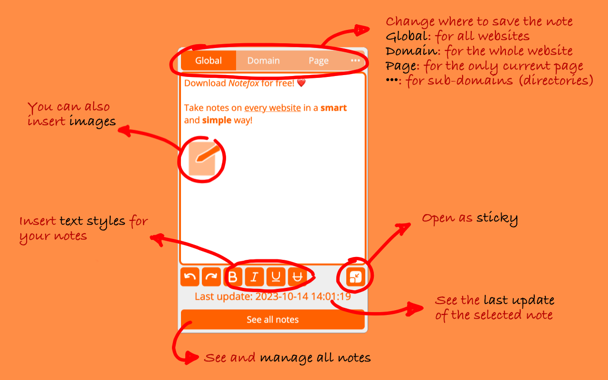
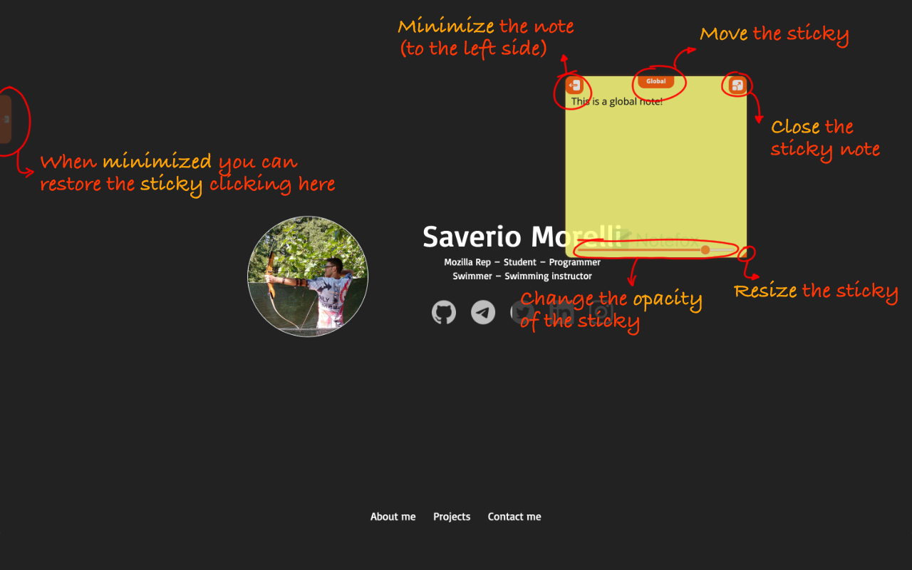

<h1 align="center">
     
    
     
    Notefox
     
</h1>
Official repo of https://addons.mozilla.org/it/firefox/addon/websites-notes/.

   

 

To support me, you can buy me a coffee making a donation ❤️ with **LiberaPay** or **PayPal**:

 [</img>](https://paypal.me/saveriomorelli)

## Description

Take notes on every website in a smart and simple way!

## Features

- Take notes on websites, you can take notes for the whole domain called "Domain" (es. `https://saveriomorelli.com`) or notes for a specific web page of a domain called "Page" (es. `https://saveriomorelli.com/projects/`)
- See all notes in a dedicated page, where you can manage them as well (export, import, clear all notes, set tag, search, etc.)
- You can customise the add-on via Options (in "Add-ons and themes" > "Extensions" > "Notefox")
- Auto-saving
- Notes as Sticky-notes (“Memo”/“Post-it")
- Keyboard shortcuts (also customisable!)

## How to contribute

You can open an issue and there you must describe the feedback, the bug or the new feature you want.
You can contribute also translating the add-on on Crowdin.

## Screenshots

See folder <code>screenshots</code> to see screenshots also of the older versions.

</img></img></img></img>
</img></img>
