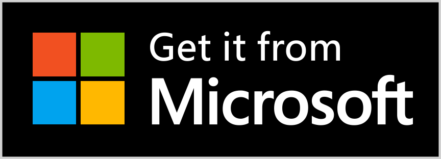
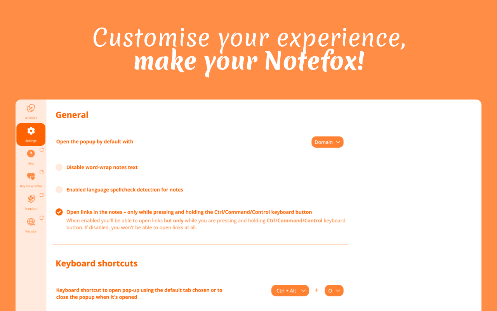
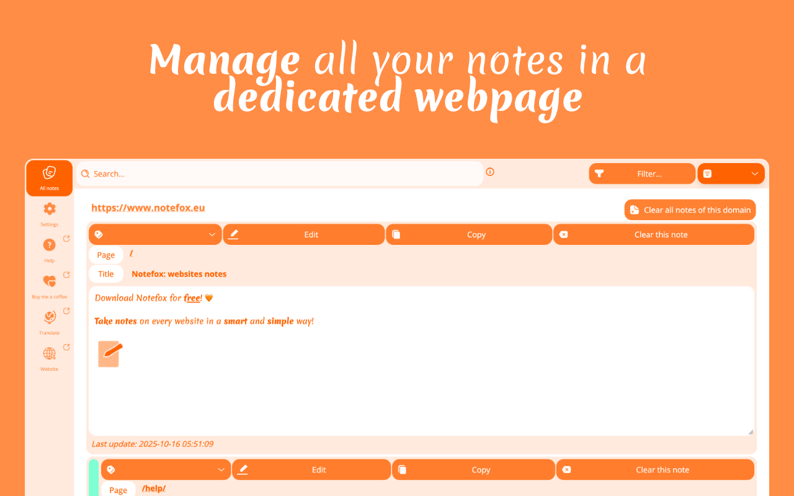
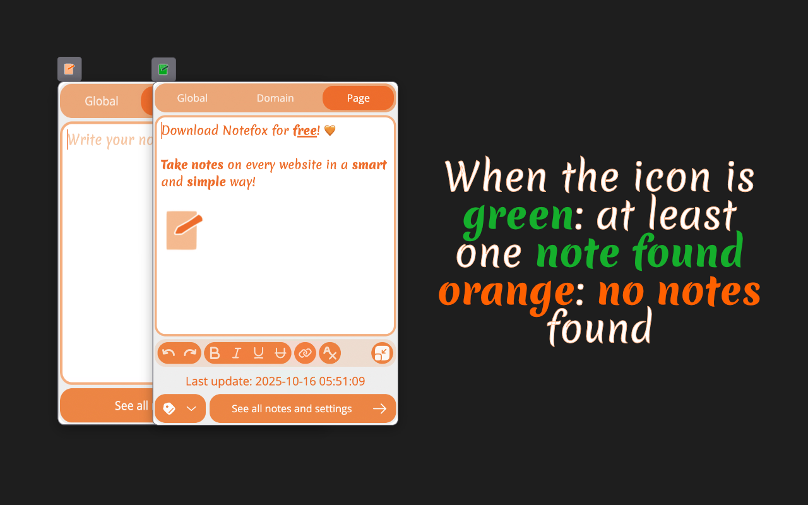
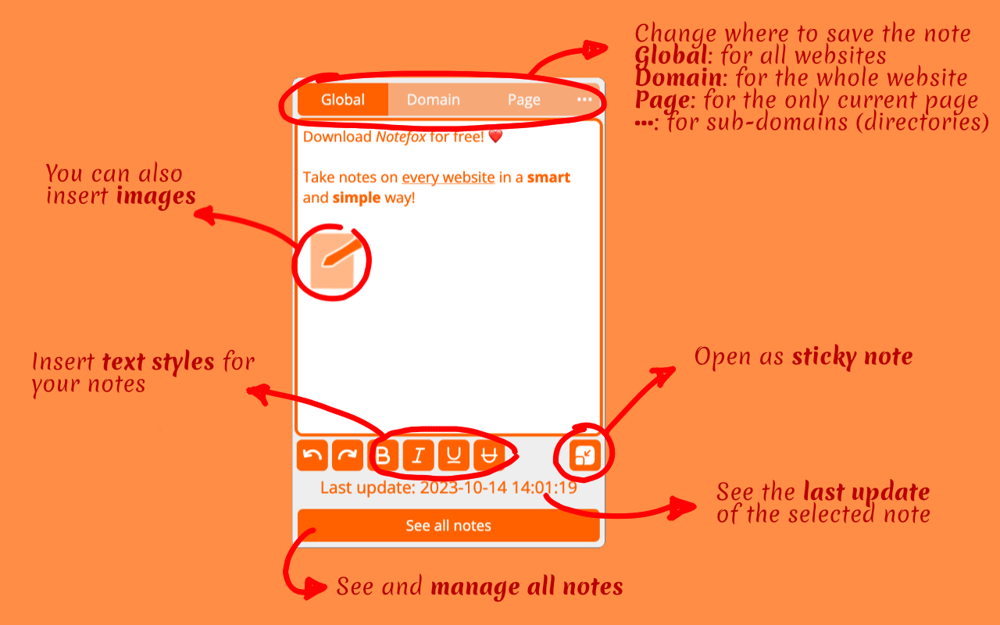
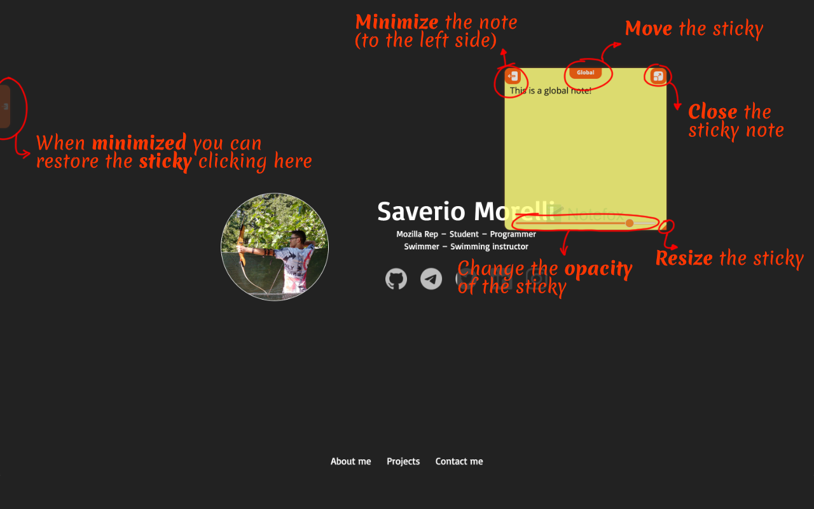

<h1 align="center">
     
    
     
    Notefox
     
</h1>
Official repo of https://addons.mozilla.org/firefox/addon/websites-notes/.

   

To support me, you can buy me a coffee making a donation ❤️ with **LiberaPay** or **PayPal**:

 [</img>](https://paypal.me/saveriomorelli)

## Description

Take notes on every website in a smart and simple way!

https://www.notefox.eu/about/

**Notefox doesn't collect any personal data if you don't use a *Notefox Account***. Telemetry and automatic sending of error logs are anonymous and *optional*: they are disabled until you enable them. Read [Privacy Policy](https://www.notefox.eu/privacy/) and [Terms of Service](https://www.notefox.eu/terms/) to know more. 

## Documentation

You can find the API documentation at this link:

https://www.notefox.eu/docs/

## Features

**Notes**
- Take notes on websites: for the whole domain ("Domain", e.g. `https://saveriomorelli.com`), for a specific page ("Page", e.g. `https://saveriomorelli.com/projects/`) or "Global" notes, visible on every website
- Notes for subdomains/sub-paths (e.g. `https://saveriomorelli.com/projects/*`) with the advanced managing of URLs
- Multiple notes for each type (Global, Domain, Page)
- Create a note from the selected text via the context menu
- Auto-saving
- Rich text formatting: bold, italic, underline, strikethrough, headers, lists, links, highlighter, code block, superscript/subscript, small/big text and undo/redo (every button can be shown or hidden)
- Titles, tag colours, tags and folders to organise your notes
- Optionally, consider URL parameters and sections as different pages

**Sticky notes**
- Open your notes as sticky notes (“Memo”/“Post-it”) directly on the web page, also more than one at the same time
- Move, resize, minimise and pin them (to keep them visible while scrolling) and change their opacity
- Immersive mode (controls shown only on hover), themes, default size, opacity and pinning

**All notes**
- See all notes in a dedicated page, where you can manage them as well: search (also in the page content), filter by tag and folder, set tags, delete, fullscreen view, etc.
- Export and import all your data (JSON file or text)

**Customisation**
- Many options in the Settings (in "Add-ons and themes" > "Extensions" > "Notefox")
- Several themes (or follow the Firefox theme), font families, text sizes and datetime formats
- Toolbar icon that becomes green (or follows the tag colour) when there are notes, and a badge with the number of notes
- Keyboard shortcuts (also customisable!)
- Sidebar support on Firefox
- Available in 30+ languages

**Notefox Account**
- Sync your notes between your devices
- Sync history: see the previous versions of your notes and restore one of them
- Two-factor authentication, active sessions management, password change and account deletion

Learn more about Notefox on the official website <a href="https://notefox.eu">https://notefox.eu</a>

## Permissions

Notefox asks only for the permissions it needs. Some of them are **optional** and they are requested only when you use the related feature: if you don't allow them, the rest of the add-on keeps working.

| Permission | Required | Why |
|---|---|---|
| `storage`, `unlimitedStorage` | Yes | Save your notes and settings locally |
| `tabs`, `activeTab` | Yes | Show the notes of the website you are visiting |
| `menus` | Yes | "Create a note" from the context menu |
| Access to all websites (`<all_urls>`) | Optional | Requested only when you open a note as a **sticky note** |
| Access to the Notefox servers (`https://*.notefox.eu/*`) | Optional | Requested only when you use the **Notefox Account** (login/sign up), the **telemetry** or the **automatic sending of error logs** |
| `downloads` | Optional | Requested only when you export your notes (or the error logs) to a file |

## Chrome version

This branch contains the **Firefox** version of Notefox (Manifest V2).

The version for **Chromium-based browsers** (Google Chrome, Microsoft Edge, etc.) is developed in the [`new-chrome`](https://github.com/Sav22999/websites-notes/tree/new-chrome) branch, which uses Manifest V3. Some features can differ between the two versions (e.g. the sidebar is available only on Firefox).

You can install it from the [Chrome Web Store](https://chromewebstore.google.com/detail/agcdffobijddcccbfnhfjmaohnljefpm) or from [Microsoft Edge Add-ons](https://microsoftedge.microsoft.com/addons/detail/lkahmkadpaibphpoiofpdinacjffddda). If you want to contribute to the Chrome version, open your pull request against the `new-chrome` branch.

## How to contribute

You can open an issue and there you must describe the feedback, the bug or the new feature you want.
You can contribute also translating the add-on on Crowdin.

# Terms of Service and Privacy Policy

You can find the Terms of Service and the Privacy Policy at these links:

https://www.notefox.eu/privacy/
https://www.notefox.eu/terms/

## Screenshots

See folder <code>screenshots</code> to see screenshots also of the older versions.

</img></img></img></img>
</img></img>
