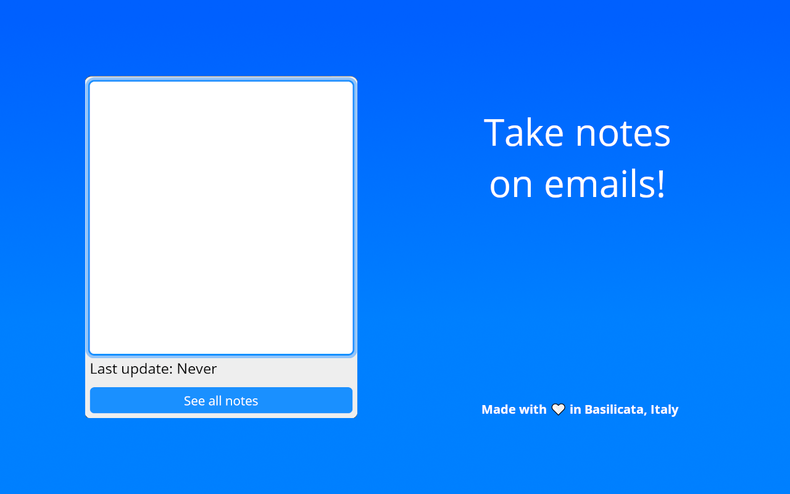

<h1 align="center">
     
    
     
</h1>
Official repo of https://addons.thunderbird.net/thunderbird/addon/notebird/.

  

 

To support me, you can do a donation :smile: with **PayPal**, **LiberaPay** or **Ko-Fi**:

 [</img>](https://paypal.me/saveriomorelli) [</img>](https://ko-fi.com/R5R31UQ8G)

## Description

Take notes on emails!

## Features

- Write notes for the email
- Autosaving

## How to contribute

You can open an issue and there you must describe the feedback, the bug or the new feature you want.

## Screenshots

See folder <code>screenshots</code> to see screenshots also of the older versions.

</img></img>
